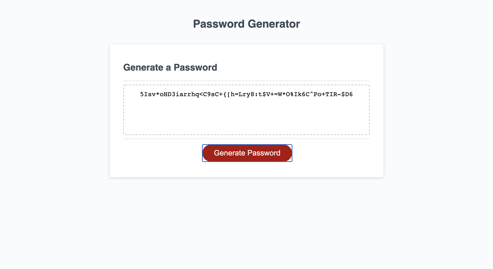

# PasswordGenerator.

## Purpose
This generates random passwords for secure access to sensitive data.

## Built With
* HTML
* CSS
* JavaScript

## Preview

# Website
https://kingopara.github.io/PasswordGenerator./

# Credit
UT Austin Coding Bootcamp

## Contributions
Made with ❤️ by Praise Opara

### praise opara

## License
[MIT](https://choosealicense.com/licenses/mit/)

## Badges 
